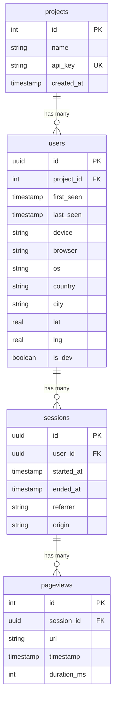

# Database Schema

HONO Analytics uses a relational database with four main tables to track projects, users, sessions, and pageviews. This page documents the complete schema and relationships.

## Schema Overview



## Table Definitions

### Projects Table

Stores project configurations and API keys.

| Column | Type | Constraints | Description |
|--------|------|-------------|-------------|
| `id` | serial | PRIMARY KEY | Auto-incrementing project ID |
| `name` | text | NOT NULL | Human-readable project name |
| `api_key` | text | NOT NULL, UNIQUE | API key for authentication |
| `created_at` | timestamp | NOT NULL, DEFAULT NOW() | Project creation timestamp |

```sql
CREATE TABLE projects (
  id SERIAL PRIMARY KEY,
  name TEXT NOT NULL,
  api_key TEXT NOT NULL UNIQUE,
  created_at TIMESTAMP DEFAULT NOW() NOT NULL
);
```

### Users Table  

Stores unique visitors and their metadata.

| Column | Type | Constraints | Description |
|--------|------|-------------|-------------|
| `id` | uuid | PRIMARY KEY | Unique user identifier |
| `project_id` | integer | NOT NULL, FK → projects.id | Associated project |
| `first_seen` | timestamp | NOT NULL, DEFAULT NOW() | First visit timestamp |
| `last_seen` | timestamp | NOT NULL, DEFAULT NOW() | Last activity timestamp |
| `device` | text | NULL | Device type (desktop, mobile, tablet) |
| `browser` | text | NULL | Browser name and version |
| `os` | text | NULL | Operating system |
| `country` | text | NULL | User's country |
| `city` | text | NULL | User's city |
| `lat` | real | NULL | Latitude coordinate |
| `lng` | real | NULL | Longitude coordinate |
| `is_dev` | boolean | NOT NULL, DEFAULT false | Development traffic flag |

```sql
CREATE TABLE users (
  id UUID DEFAULT gen_random_uuid() PRIMARY KEY,
  project_id INTEGER REFERENCES projects(id) NOT NULL,
  first_seen TIMESTAMP DEFAULT NOW() NOT NULL,
  last_seen TIMESTAMP DEFAULT NOW() NOT NULL,
  device TEXT,
  browser TEXT,
  os TEXT,
  country TEXT,
  city TEXT,
  lat REAL,
  lng REAL,
  is_dev BOOLEAN DEFAULT false NOT NULL
);
```

### Sessions Table

Tracks user sessions with referrer information.

| Column | Type | Constraints | Description |
|--------|------|-------------|-------------|
| `id` | uuid | PRIMARY KEY | Unique session identifier |
| `user_id` | uuid | NOT NULL, FK → users.id | Associated user |
| `started_at` | timestamp | NOT NULL, DEFAULT NOW() | Session start time |
| `ended_at` | timestamp | NULL | Session end time (nullable) |
| `referrer` | text | NULL | HTTP referrer URL |
| `origin` | text | NULL | Traffic origin (parsed from referrer) |

```sql
CREATE TABLE sessions (
  id UUID DEFAULT gen_random_uuid() PRIMARY KEY,
  user_id UUID REFERENCES users(id) NOT NULL,
  started_at TIMESTAMP DEFAULT NOW() NOT NULL,
  ended_at TIMESTAMP,
  referrer TEXT,
  origin TEXT
);
```

### Pageviews Table

Records individual page visits and interactions.

| Column | Type | Constraints | Description |
|--------|------|-------------|-------------|
| `id` | serial | PRIMARY KEY | Auto-incrementing pageview ID |
| `session_id` | uuid | NOT NULL, FK → sessions.id | Associated session |
| `url` | text | NOT NULL | Visited URL |
| `timestamp` | timestamp | NOT NULL, DEFAULT NOW() | Pageview timestamp |
| `duration_ms` | integer | NULL | Time spent on page (milliseconds) |

```sql
CREATE TABLE pageviews (
  id SERIAL PRIMARY KEY,
  session_id UUID REFERENCES sessions(id) NOT NULL,
  url TEXT NOT NULL,
  timestamp TIMESTAMP DEFAULT NOW() NOT NULL,
  duration_ms INTEGER
);
```

## Relationships

### One-to-Many Relationships

1. **Projects → Users**: Each project can have multiple users
2. **Users → Sessions**: Each user can have multiple sessions  
3. **Sessions → Pageviews**: Each session can have multiple pageviews

### Foreign Key Constraints

- `users.project_id` → `projects.id`
- `sessions.user_id` → `users.id`
- `pageviews.session_id` → `sessions.id`

## Indexes

Recommended indexes for optimal query performance:

```sql
-- User lookups by project
CREATE INDEX idx_users_project_id ON users(project_id);

-- Session lookups by user
CREATE INDEX idx_sessions_user_id ON sessions(user_id);

-- Pageview lookups by session
CREATE INDEX idx_pageviews_session_id ON pageviews(session_id);

-- Time-based queries
CREATE INDEX idx_users_last_seen ON users(last_seen);
CREATE INDEX idx_sessions_started_at ON sessions(started_at);
CREATE INDEX idx_pageviews_timestamp ON pageviews(timestamp);

-- URL analysis
CREATE INDEX idx_pageviews_url ON pageviews(url);

-- Development traffic filtering
CREATE INDEX idx_users_is_dev ON users(is_dev);
```

## Data Types

### PostgreSQL Types

The schema uses PostgreSQL-specific types:
- `serial`: Auto-incrementing integer
- `uuid`: Universally unique identifier
- `timestamp`: Date and time
- `real`: Single precision floating point
- `text`: Variable-length character string

### SQLite Compatibility

For development with SQLite, types are automatically mapped:
- `serial` → `INTEGER PRIMARY KEY`
- `uuid` → `TEXT`
- `timestamp` → `TEXT` (ISO 8601)
- `real` → `REAL`
- `text` → `TEXT`

## Sample Data

### Example Records

```sql
-- Projects
INSERT INTO projects (name, api_key) VALUES 
('My Website', 'web-key-123'),
('Mobile App', 'mobile-key-456');

-- Users
INSERT INTO users (id, project_id, device, browser, country) VALUES
('550e8400-e29b-41d4-a716-446655440000', 1, 'desktop', 'Chrome 120', 'Netherlands'),
('6ba7b810-9dad-11d1-80b4-00c04fd430c8', 1, 'mobile', 'Safari 17', 'Germany');

-- Sessions  
INSERT INTO sessions (id, user_id, referrer, origin) VALUES
('550e8400-e29b-41d4-a716-446655440001', '550e8400-e29b-41d4-a716-446655440000', 'https://google.com', 'google'),
('6ba7b810-9dad-11d1-80b4-00c04fd430c9', '6ba7b810-9dad-11d1-80b4-00c04fd430c8', 'https://twitter.com', 'twitter');

-- Pageviews
INSERT INTO pageviews (session_id, url, duration_ms) VALUES
('550e8400-e29b-41d4-a716-446655440001', '/', 5000),
('550e8400-e29b-41d4-a716-446655440001', '/features', 3000),
('6ba7b810-9dad-11d1-80b4-00c04fd430c9', '/mobile', 2500);
```

## Common Queries

### User Analytics

```sql
-- Total unique users per project
SELECT p.name, COUNT(DISTINCT u.id) as users
FROM projects p
LEFT JOIN users u ON p.id = u.project_id
WHERE u.is_dev = false
GROUP BY p.id, p.name;

-- Top countries by user count
SELECT country, COUNT(*) as user_count
FROM users 
WHERE country IS NOT NULL AND is_dev = false
GROUP BY country
ORDER BY user_count DESC
LIMIT 10;
```

### Session Analytics

```sql
-- Average session duration
SELECT AVG(EXTRACT(EPOCH FROM (ended_at - started_at))) as avg_duration_seconds
FROM sessions 
WHERE ended_at IS NOT NULL;

-- Sessions by referrer
SELECT origin, COUNT(*) as session_count
FROM sessions
WHERE origin IS NOT NULL
GROUP BY origin
ORDER BY session_count DESC;
```

### Pageview Analytics

```sql
-- Most visited pages
SELECT url, COUNT(*) as views, AVG(duration_ms) as avg_duration
FROM pageviews
GROUP BY url
ORDER BY views DESC
LIMIT 20;

-- Daily pageview trends
SELECT DATE(timestamp) as date, COUNT(*) as pageviews
FROM pageviews
WHERE timestamp >= NOW() - INTERVAL '30 days'
GROUP BY DATE(timestamp)
ORDER BY date;
```

## Migration Scripts

### Initial Schema Migration

```sql
-- Create tables in dependency order
CREATE TABLE projects (
  id SERIAL PRIMARY KEY,
  name TEXT NOT NULL,
  api_key TEXT NOT NULL UNIQUE,
  created_at TIMESTAMP DEFAULT NOW() NOT NULL
);

CREATE TABLE users (
  id UUID DEFAULT gen_random_uuid() PRIMARY KEY,
  project_id INTEGER REFERENCES projects(id) NOT NULL,
  first_seen TIMESTAMP DEFAULT NOW() NOT NULL,
  last_seen TIMESTAMP DEFAULT NOW() NOT NULL,
  device TEXT,
  browser TEXT,
  os TEXT,
  country TEXT,
  city TEXT,
  lat REAL,
  lng REAL,
  is_dev BOOLEAN DEFAULT false NOT NULL
);

CREATE TABLE sessions (
  id UUID DEFAULT gen_random_uuid() PRIMARY KEY,
  user_id UUID REFERENCES users(id) NOT NULL,
  started_at TIMESTAMP DEFAULT NOW() NOT NULL,
  ended_at TIMESTAMP,
  referrer TEXT,
  origin TEXT
);

CREATE TABLE pageviews (
  id SERIAL PRIMARY KEY,
  session_id UUID REFERENCES sessions(id) NOT NULL,
  url TEXT NOT NULL,
  timestamp TIMESTAMP DEFAULT NOW() NOT NULL,
  duration_ms INTEGER
);

-- Create indexes
CREATE INDEX idx_users_project_id ON users(project_id);
CREATE INDEX idx_sessions_user_id ON sessions(user_id);
CREATE INDEX idx_pageviews_session_id ON pageviews(session_id);
CREATE INDEX idx_users_last_seen ON users(last_seen);
CREATE INDEX idx_pageviews_timestamp ON pageviews(timestamp);
```

## Drizzle ORM Integration

The schema is defined using [Drizzle ORM](https://orm.drizzle.team/) in `packages/backend/src/db/schema.ts`:

```typescript path=/packages/backend/src/db/schema.ts start=1
import { sql } from 'drizzle-orm'
import { 
  pgTable, 
  text, 
  integer, 
  timestamp, 
  boolean, 
  uuid, 
  serial, 
  real
} from 'drizzle-orm/pg-core'

export const projects = pgTable('projects', {
  id: serial('id').primaryKey(),
  name: text('name').notNull(),
  apiKey: text('api_key').notNull().unique(),
  createdAt: timestamp('created_at').defaultNow().notNull()
})
```

### Type Safety

Drizzle provides full TypeScript type safety:

```typescript path=null start=null
import type { InferSelectModel, InferInsertModel } from 'drizzle-orm'
import type { projects, users, sessions, pageviews } from './db/schema'

type TProject = InferSelectModel<typeof projects>
type TUser = InferSelectModel<typeof users>
type TSession = InferSelectModel<typeof sessions>
type TPageview = InferSelectModel<typeof pageviews>

type TInsertUser = InferInsertModel<typeof users>
```

## Data Retention

Consider implementing data retention policies:

```sql
-- Delete old pageviews (older than 2 years)
DELETE FROM pageviews 
WHERE timestamp < NOW() - INTERVAL '2 years';

-- Delete orphaned sessions
DELETE FROM sessions 
WHERE id NOT IN (SELECT DISTINCT session_id FROM pageviews);

-- Delete inactive users (no activity in 1 year)
DELETE FROM users 
WHERE last_seen < NOW() - INTERVAL '1 year'
  AND id NOT IN (SELECT DISTINCT user_id FROM sessions);
```

## Backup and Maintenance

### Regular Backups

```bash
# PostgreSQL backup
pg_dump $DATABASE_URL > analytics_backup_$(date +%Y%m%d).sql

# SQLite backup
cp packages/backend/analytics.db analytics_backup_$(date +%Y%m%d).db
```

### Database Maintenance

```sql
-- Update table statistics
ANALYZE projects, users, sessions, pageviews;

-- Rebuild indexes if needed
REINDEX TABLE users;
REINDEX TABLE sessions;
REINDEX TABLE pageviews;
```

## Next Steps

<Cards>
  <Card title="Configuration" href="/docs/configuration" description="Database connection and environment setup" />
  <Card title="API Reference" href="/docs/api" description="API endpoints that interact with the database" />
  <Card title="Getting Started" href="/docs/getting-started" description="Initial setup and migration commands" />
  <Card title="Deployment" href="/docs/deployment" description="Production database setup" />
</Cards>
